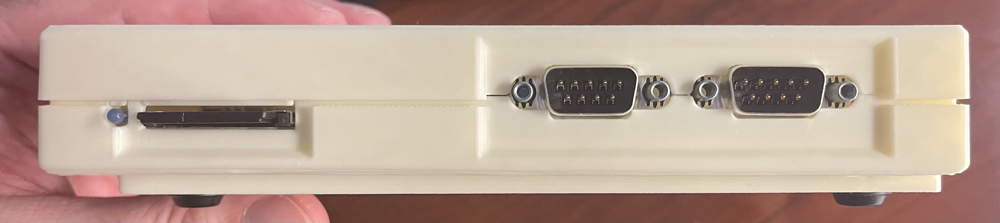
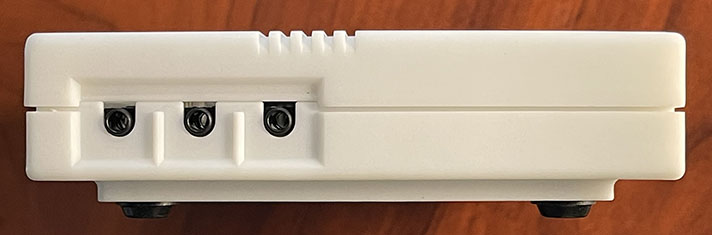
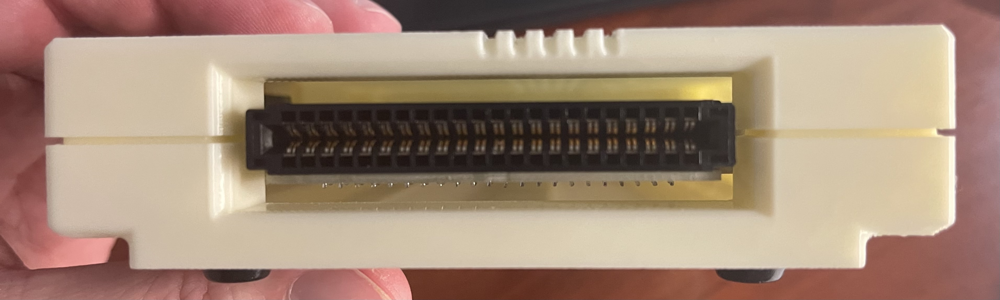
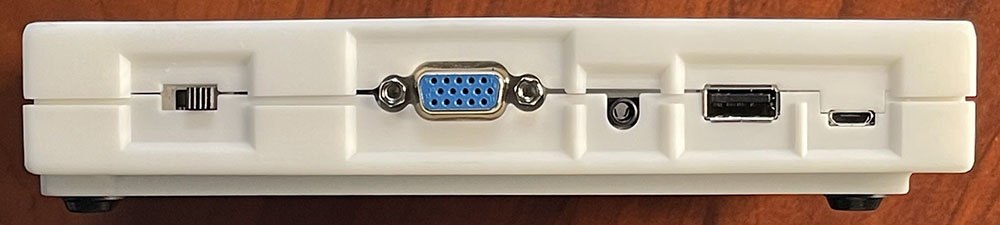

# Aquarius+ Quick Start

This document shows you how to quickly get up and running on your Aquarius+.

## The Case

Below are images of each of the four sides of the Aquarius+, identifying the ports and what they're used for.

### Front


Ports (Left to Right):

- LED light - When lit, indicates when the Aquarius+ is functioning
- SD card slot - Your SD card goes in here. Note that this should be formatted before you insert it, and the contents of the [sdcard](sdcard) folder should be copied to it.
- Aquarius Control Pad Port 1 - This port is for an Aquarius Controller, used typically to control Player 1 in games.
- Aquarius Control Pad Port 2 - This port is for an Aquarius Controller, used typically to control Player 2 in games.

### Left


Ports (Left to Right):

- Cassette OUT Port\* - Use a standard 3mm / 1/8" audio connector and connect this port to the "speaker" or "ear" port on a Data Recorder.
- Cassette IN Port\* - Use a standard 3mm / 1/8" audio connector and connect this port to the "mic" or "in" port on a Data Recorder.
- Printer Port\* - Use an Aquarius Printer cable and connect this port to the Aquarius Thermal or Pen printers.

\*_Note that on early versions of rev2 PCB, these jacks are surface-mounted to the PCB, and can be very delicate. They have since been changed to a through-hole mount for better stability, but care should be taken._

### Right


Ports:

- Expansion/Cartridge Port - This port will accept Aquarius ROM software cartridges.
  - RAM cartridges or expanders with RAM on-board will not work on the Aquarius+ and will usually cause the system to crash.
  - Cartridges or expanders which have IO devices that map to the same device IDs as the Aquarius+ (like the AY-3-8910 sound chip in the Mini, Micro, or MX expanders) will usually cause the system to crash.

### Back


Ports (Left to Right):

- Power Switch - This allows 5v from the USB Micro Power Port to power the system. RIGHT is OFF. LEFT is ON.
- VGA Port - Plug your standard VGA monitor into this port for video output.
- Audio Out Port (Stereo)\* - This 3mm / 1/8" stereo audio out jack can be connected to powered speakers to output the Aquarius+ sound.
- USB Keyboard Input = Connect a basic, wired USB keyboard to this port for text input. At this time, only wired USB keyboards work.
- Micro USB Power In - This is the power input for the Aquarius+. A USB power supply with an output current rating of at least 2.1A is recommended.

\*_Note that on early versions of rev2 PCB, the Audio Out Port jack is surface-mounted to the PCB, and can be very delicate. It has since been changed to a through-hole mount for better stability, but care should be taken._

### Top

The top of the Aquarius+ case features an inset logo and five "racing lines", reminiscent of the design of other Mattel Electronics devices from the late 1970's through early 1980's. The components inside the Aquarius+ don't usually get warm, but it's best if no other items or equipment are placed on top of the device while it's turned on.

### Bottom

The bottom of the Aquarius+ case has stylized ventilation grills that mimic those on the original Aquarius, surrounded by four rubber feet. While the Aquarius+ does not usually get warm, it's best to leave the area around the unit open so that airflow can naturally cool the components as needed.

In the middle of these grill holes is the Aquarius+ label, indicating the model number, serial number, and manufacture date of the device. Some units may also indicate unique features of the device, such as if it is a prototype or other limited edition.

Also on the bottom are the four screws which hold the case together. Note that the screw posts can be fragile and may wear out after repeated opening and reclosing of the case. Care should be taken to not strip these posts out, but hot glue or construction adhesive (cured 48 hours) can be used to "re-thread" these posts.

## Turning on the Aquarius+

Once all devices and cables have been attached to the Aquarius+, it's time to turn the unit on. Reach to the right rear of the case and flip the power switch to the RIGHT side of the case to turn it on.

Your monitor should show the Aquarius+ startup screen, prompting you to press the RETURN key to begin. After the RETURN key is pressed, you are brought to the Aquarius+ BASIC screen. To see what's on your SD card, type the following text and press RETURN:

    dir         <- Type this and hit RETURN

A list of the folders and files at the root of the SD card are listed, followed by `Ok`, which is the Aquarius' way of letting you know it's done. To go into one of these folders, you use the `cd` (change directory) command. Let's go into the `roms` folder where all the original Aquarius game cartridge images are stored...

    cd "roms"                      <- You type this and hit RETURN
    Ok                             <- Aquarius types this
    dir                            <- You type this and hit RETURN
    23-07-16 11:51   16K AD&D.rom  <- Aquarius lists these items...
    ...
    23-07-16 11:51   16K Zero-In.rom
    OK                             <- ...and then says OK

Now, lets run the Mini Expander Diagnostic ROM to show that the system is connected properly.

    run "Minidiag.rom"    <- Type this and hit RETURN

The Mini Diagnostic will go through the RAM and sound, and will also test the Aquarius Controllers, if you have them attached:

- Only 16K of RAM is tested, even though the Aquarius+ has 512k of RAM
- Only the first AY-3-8910 sound chip is tested, even though the Aquarius+ has TWO virtual sound chips.
- The USB keyboard can emulate SOME of the functions of the Aquarius Controller in Port 1. To test buttons 1-6, press F1-F6, and to test the control disc, press the CURSOR keys.

When you are done, to RESET the Aquarius+, you can either switch it off an on again, OR you can press CTRL + ESC to reset via the keyboard.

Spend some time navigating the folders on the SD drive. Here are some basic navigation functions using the `CD` command:

    CD                 <- Type this and hit RETURN to show the current PATH

    CD "foldername"    <- Type this to go into a folder
    CD "foldername     <- Note that the final " is optional

    CD ".."            <- Type this to "back up" one folder

    CD "/"             <- Type this to go to the ROOT of the SD card

The Aquarius+ can `RUN` a few filetypes automatically. Find some of these filetypes in the folders and experiment.

    RUN "run-me.bas"   <- Loads and runs this BASIC program

    RUN "tiledemo.caq" <- Loads and runs this Aquarius Cassette file program

    RUN "Utopia.rom"   <- Loads and runs this Aquarius ROM cartridge image

Some BASIC and CAQ files can be ended by pressing CTRL + C, but not always. Sometimes the CTRL + ESC reset sequence must be typed to reset the system.

Aquarius+ can `LOAD` both CAQ and BASIC files/programs without running them.

    LOAD "run-me.bas"  <- Loads the BASIC program without running it
    OK
    LIST               <- Lists the lines of BASIC code
    10 REM HELLO
    20 PRINT "Hello!"
    30 GOTO 20
    OK

The program can then be `RUN` once loaded.

BASIC programs can also be saved to SD card using the `SAVE` command. The file is saved in the current directory, so make sure you're in the correct path to save your file.

    SAVE "MyProgram.bas"   <- This will save your BASIC program

You can also delete files on the SD card using the `DEL` command.

    DEL "MyProgram.bas"    <- This will delete your previously saved program

There are many more commands and parameters that can be used to work with files on the Aquarius+ SD card. A fully featured programming guide for the Aquarius+ is forthcoming.

## Using an Xbox Series S/X controller with the Aquarius+

Your Aquarius+ has builtin Bluetooth support, which enables it to connect to a Xbox controller. The Xbox controller can be only be used wirelessly and will act as if connected to Aquarius Control Pad Port 1.

The first time you want to use the controller, you have to pair it:

- Turn on the Aquarius+.
- Turn on the Xbox controller by pressing the round Xbox button.
- Press the little pair button on the back of the controller until the Xbox button start flashing rapidly.
- Within a few seconds the Xbox button will stop flashing indicating the controller is paired.

To turn off the Xbox controller press and hold the Xbox button for about 6 seconds.

Next time you want to use the controller you don't have to pair it again and it will automatically connect to your Aquarius+ when turned on.

You will need to use the pairing function again if you've used your Xbox controller with another system.

## Setting up Wi-Fi

Your Aquarius+ has builtin Wi-Fi support. Currently this allows for several useful features (more to come with future firmware updates):

- Time synchronization. Files saved to the SD card will get a correct date/time. Note there is no time zone support yet, so the files will use the UTC time.
- Accessing the SD card from a remote computer via de WebDav protocol. Your Aquarius+ registers itself to your router with as 'aqplus' and can be accessed via this name.
- Remotely typing commands. This is used by the development environment in combination with the WebDav support to upload and start your program remotely.

To enter the settings menu, on the BASIC prompt type:

```
RUN "esp:settings.caq"
```

This will start the settings program and allows for configuring Wi-Fi and updating your system to a newer firmware version.

On the `ESP>` prompt type `WIFI SET` and follow the on-screen instructions.

After entering the Wi-Fi details, you can use the `WIFI` command on the `ESP>` prompt to see if your Wi-Fi is connected.

The `DATE` command allows you to see if the time sync has been performed.

Press CTRL + C to return back to BASIC.

## More to come...
